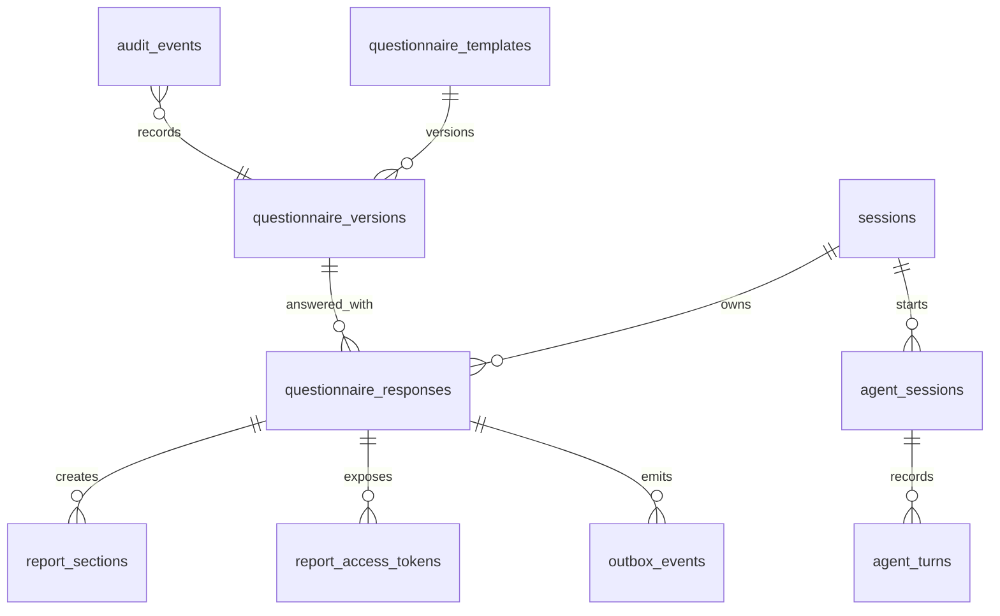

# ERD Summary

Phase 1 stores questionnaire versions, submissions, public report sections,
voice-agent turns, audit events, and retryable outbox events in PostgreSQL.

Key controls:

- `questionnaire_versions` keeps SurveyJS JSON and scoring config as versioned
  source.
- `questionnaire_responses` stores raw answers internally and public-safe
  summaries separately.
- `report_sections` and `report_access_tokens` power QR-ready public access
  without exposing raw answers.
- `agent_turns` records ASR/respond/TTS/map-answer evidence for review.
- `outbox_events` keeps Redpanda publication retryable and non-blocking.
