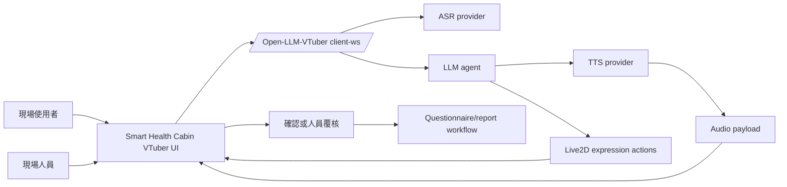

# Open-LLM-VTuber Second Stack SDD

## FIRST PRINCIPLE

- Scarce resource: real-time voice-avatar delivery quality, Taiwan Mandarin
  trust, and implementation attention.
- Canonical home: this repo owns the second-stack design, contracts, bridge,
  evidence, and future UI/runtime implementation.
- Planning role: `../planning-everything-track/` records calendar, status,
  capacity impact, next gate, and blocker only.
- Scope control: this is a screening-support and health-measurement workflow
  assistant, not a diagnosis or treatment system.

## Product Thesis

Open-LLM-VTuber gives Smart Health Cabin a lower-friction second stack because
it already owns the voice-avatar skeleton: ASR, LLM, TTS, interruption, Live2D,
frontend/backend split, and modular provider selection. Our project should
replace the generic companion UI with a Taiwan health-measurement station UI,
then tune ASR/TTS and Live2D assets for Taiwan Traditional Chinese service use.

## System Boundary

The second stack can integrate with the existing questionnaire/report workflow
only through explicit activation gates. Until then, it is a lab/product-design
lane with bridge evidence.

## Architecture

| Component | Current state | Target state |
| --- | --- | --- |
| Upstream backend | Pinned in `.local/Open-LLM-VTuber` | Remains pinned or vendored only through a deliberate update note. |
| WebSocket API | `/client-ws` works in lab | Product frontend speaks this contract directly. |
| Bridge | `POST /v1/turn` lab adapter exists | Kept for smoke tests and compatibility, not product UI. |
| Frontend | Upstream generic companion UI | Fully replaced by a tracked Smart Health Cabin UI. |
| ASR | `sherpa_onnx_asr` SenseVoiceSmall baseline | Taiwan Mandarin room-tested provider with device auto-selection and VAD tuning. |
| LLM | Ollama Gemma lab config | Taiwan health-station prompt and confirmation workflow. |
| TTS | Edge TTS zh-TW lab baseline | Real-time Taiwan Mandarin voice candidate with listener acceptance. |
| Live2D | Upstream sample model path | Licensed health-service character and background design. |

## Frontend Strategy

The frontend should be rebuilt as a product-owned app in this repo and connect
to Open-LLM-VTuber through `/client-ws`. This is more stable than editing the
ignored upstream `frontend` output in `.local/Open-LLM-VTuber`.

Implementation route:

1. Create a tracked frontend package, for example
   `apps/open-llm-vtuber-kiosk-web/`.
2. Implement the `/client-ws` client, Live2D stage, microphone capture,
   interruption, audio playback, and health-station workflow state.
3. Reuse upstream backend assets and config only through documented contracts.
4. Keep UI copy in Taiwan Traditional Chinese.
5. Keep touch fallback and staff-review path visible and available.

## ASR/TTS Strategy

ASR and TTS are separate provider decisions.

ASR target:

- recognize Taiwan Mandarin in the actual room setup;
- handle measurement terms and questionnaire options;
- expose confidence or N-best when the provider supports it;
- never write questionnaire answers without confirmation.

TTS target:

- real-time or near-real-time perceived response;
- Taiwan Mandarin accent;
- no China-accent production default;
- stable Traditional Chinese service wording;
- exact prompt-audio transcript matching for any voice-cloning path.

## Live2D Strategy

The Live2D character must feel like a health-measurement station assistant, not
a generic streamer avatar.

Required design states:

- idle/listening;
- speaking/explaining;
- confirming user choice;
- staff-review handoff;
- recovery/retry;
- completed/next-step.

Required asset controls:

- Cubism 3 to Cubism 5 only;
- license-cleared model for external or company-facing use;
- model folder under `live2d-models/`;
- `model_dict.json` entry;
- `live2d_model_name` in character config;
- background assets under `backgrounds/`.

## Acceptance Gates

| Gate | Evidence |
| --- | --- |
| UI contract gate | Custom frontend can connect, receive model config, send text turn, play audio, and show Traditional Chinese subtitles. |
| ASR room gate | Real microphone Taiwan Mandarin samples transcribe with measured latency and recovery behavior. |
| TTS Taiwan gate | Listener review accepts accent, pronunciation, speed, and service tone. |
| Live2D gate | Licensed model loads, expressions map correctly, and background fits kiosk layout. |
| Workflow gate | Voice turn can guide a health-check/questionnaire step without bypassing confirmation or staff review. |
| Rollback gate | First stack or touch-only mode remains available as operational fallback. |

## Data And Logging

Every second-stack test should record:

- date, local time, timezone;
- command or browser route;
- upstream commit and frontend build commit;
- ASR provider and microphone device;
- TTS provider, voice, and prompt profile;
- Live2D model name and license status;
- turn latency, ASR latency, first audio payload time, playback duration;
- transcript, display text, internal TTS text language, and recovery outcome;
- generated audio artifact path when available.

## Rollout Plan

1. Document contracts and planning pivot.
2. Build product-owned frontend shell against `/client-ws`.
3. Replace generic companion copy and layout with health-station UI.
4. Run lab text-turn and audio playback checks.
5. Run microphone ASR room tests.
6. Compare TTS providers for Taiwan Mandarin and real-time latency.
7. Add license-cleared Live2D model and background.
8. Decide whether `VOICE_STACK=open_llm_vtuber_v1` can become the product
   candidate.

## Current Decision

The second stack is active for design and next implementation. The earlier
voice stack remains preserved as historical evidence and fallback. It is not
the daily主攻 path after this pivot.

