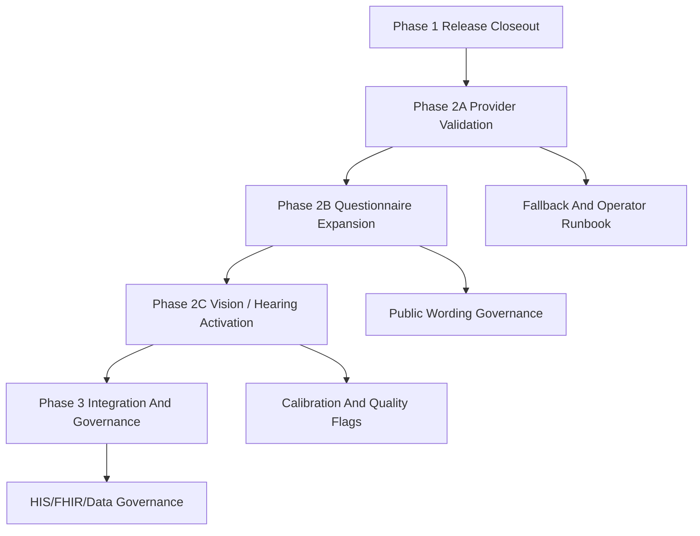

# Phase 2 Activation Roadmap

## Recommendation

Start Phase 2 with provider validation before adding more clinical/questionnaire
surface area.

Reason:

```text
The demo's credibility now depends on measured local ASR / LLM / TTS behavior,
not more UI breadth.
```

## Phase 2 Lanes

| Lane | Name | Goal | Start When |
| --- | --- | --- | --- |
| 2A | Provider validation | Prove local ASR/LLM/TTS can support the kiosk environment. | Sprint 5 live evidence is frozen. |
| 2B | Questionnaire expansion | Add more source-backed questionnaires with scoring/public wording governance. | Provider fallback and CMS flow are stable. |
| 2C | Vision/hearing activation | Add deferred measurement modules with calibration and quality flags. | Phase 1 stays replayable after provider/questionnaire changes. |
| 3 | Integration/governance | HIS/FHIR/export/security/clinical validation path. | Stakeholder confirms data ownership and production boundary. |

## Mermaid Roadmap



## Phase 2 Acceptance Style

Each activation lane must state:

- input evidence;
- implementation owner;
- test evidence;
- safety boundary;
- rollback/fallback path;
- stakeholder decision needed.

No lane should claim clinical diagnosis or production validation without a
separate approved validation path.

