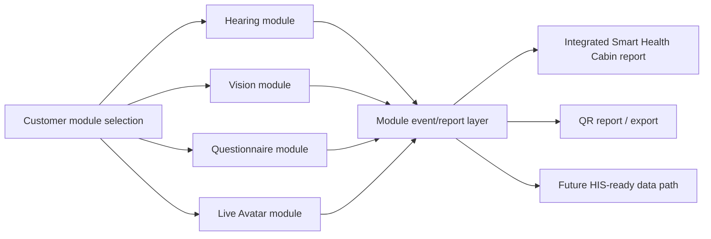

# Smart Health Cabin Module Research Packet

## Identity

- Packet date: 2026-06-24
- Project: 慧誠智醫（imedtac Co., Ltd.）Smart Health Cabin collaboration
- Canonical repo: `../imedtac-smart-health-cabin-v0`
- Planning locator:
  `../planning-everything-track/data/projects/2026-06-imedtac-smart-health-cabin.md`
- Active workstream:
  `../../workstreams/smart-health-cabin/`

## Research Thesis

The Smart Health Cabin should be packaged as customer-selectable modules, not
as one forced all-in-one system. The research question is whether open-source
GitHub projects can be adapted into independent hearing, vision, questionnaire,
and live Avatar interaction modules while sharing a common structured
event/report layer.

## Packet Set

| Packet | Role | Relationship |
| --- | --- | --- |
| `hearing-module/README.md` | Hearing self-check / screening-support module research | Produces hearing result events and report text for the shared event layer |
| `vision-module/README.md` | Vision self-check / screening-support module research | Produces vision result events and report text for the shared event layer |
| `questionnaire-module/README.md` | Public-health questionnaire and risk-factor self-assessment research | Provides structured answers and review prompts consumed by report and Avatar flows |
| `live-avatar-module/README.md` | Live Avatar interaction, guidance, and education research | Guides users through enabled modules and records interaction events |
| `module-event-layer/README.md` | Small Kafka-like module event/report layer research | Connects all modules without forcing full Kafka infrastructure at MVP stage |
| `module-event-layer/mvp-monorepo-redpanda-architecture-note.md` | MVP monorepo / Redpanda reference architecture note | Explains how one repo, modular monolith boundaries, PostgreSQL, Redpanda, and event contracts can support a fast MVP |
| `cross-packet-relationship-map.md` | Full relationship map | Shows how the packets connect inside the Smart Health Cabin system |
| `open-source-candidate-template.md` | Candidate evaluation template | Reusable table for future GitHub repo findings |

## System Frame



## Shared Design Controls

- Each module has its own activation state, version, input contract, output
  contract, and quality/review state.
- Each module can be enabled without forcing the other modules.
- The shared event/report layer receives module outputs and assembles a cabin
  session record.
- Kafka-like infrastructure remains an activation gate. The MVP should start
  with a small append-only event table, JSONL log, or queue unless replay,
  multiple consumers, ordering, or service scale requires more.
- Clinical and public-health wording stays in screening-support,
  self-assessment, staff-review, education, and follow-up-prompt scope.

## Current Evidence Status

This packet records the research design and Jason's 2026-06-24 idea. Candidate
open-source repositories are pending and should be appended after actual repo
research is posted.

Primary intake note:

```text
../../workstreams/smart-health-cabin/2026-06-24-open-source-module-research-plan.md
```
