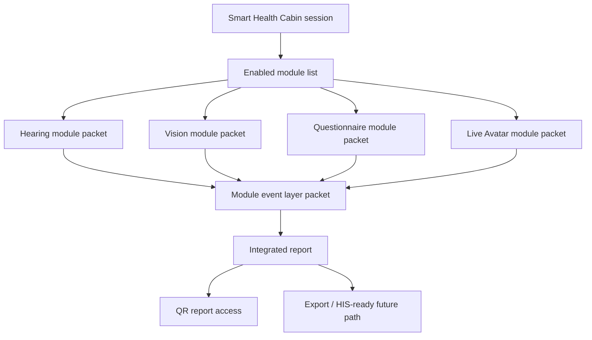

# Cross-Packet Relationship Map

## Project Relationship

This packet belongs to the Smart Health Cabin collaboration repo:

```text
../imedtac-smart-health-cabin-v0
```

It is adjacent to, but separate from, the AI Triage kiosk demo repo:

```text
../imedtac-ai-triage-kiosk-v0
```

Planning remains the control plane:

```text
../planning-everything-track/data/projects/2026-06-imedtac-smart-health-cabin.md
```

## Module Relationship



## Packet Dependency Rules

| Packet | Depends on | Feeds into | Must stay independent because |
| --- | --- | --- | --- |
| Hearing | Device/audio facts, hearing workflow source | Module event layer, integrated report, Avatar guidance | A customer may want hearing only |
| Vision | Display/distance/device facts, vision workflow source | Module event layer, integrated report, Avatar guidance | A customer may want vision only |
| Questionnaire | HPA/WHO/local form source, review owner | Module event layer, report, Avatar prompts | A customer may want questionnaire-only public-health self-assessment |
| Live Avatar | Enabled module list, script/prompts, education content | Event layer, module guidance, report completion state | Avatar should guide modules but not own their clinical logic |
| Module event layer | All module output contracts | Report, QR, export, future HIS-ready path | Shared infrastructure must not force a full module bundle |

## Shared Contract

Every module packet should define:

- activation state;
- input contract;
- output contract;
- event payload;
- module version;
- quality flag;
- review state;
- report contribution;
- source and validation gate.

## Implementation Principle

Start with the smallest shared layer that preserves module independence. A
Kafka-like structure becomes valuable only when the project has more than one
downstream consumer, replay needs, ordering requirements, real-time fan-out, or
multi-service deployment pressure.
