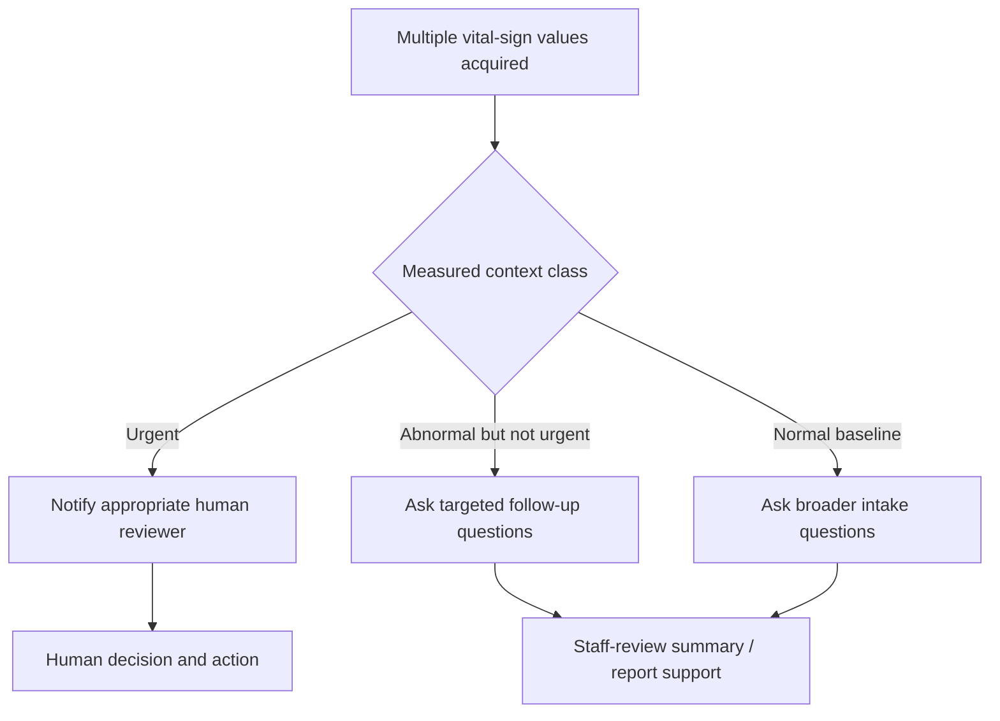
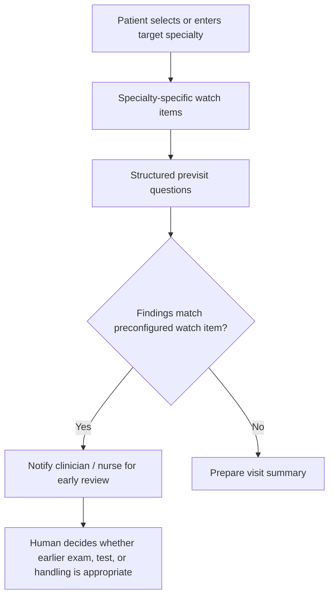

# 2026-06-19 Prof. Wu / Tomi AI Triage And Smart Health Cabin IP Sync Record

## Executive Reading

The `2026-06-19` meeting turns the `2026-06-23` onsite visit into an
IP-aware discovery meeting. The team should still inspect equipment and clarify
慧誠智醫（imedtac Co., Ltd.）requirements, but the operating posture is now:

```text
listen first
-> collect device and workflow facts
-> avoid proactive patent disclosure
-> prepare internal 1-2 page block diagrams for Prof. Wu / Tomi
-> keep external discussion at capability, scope, and feasibility level
```

The strongest positive thesis after the meeting is:

```text
The valuable system is not a generic questionnaire. It is a measured-context
workflow that uses multiple vital-sign inputs and structured questioning to
route cases into useful human-review actions: urgent notification, targeted
follow-up questions, or broader baseline intake and summary.
```

## Source-To-Source Connection Map

| 6/19 finding | Connected repo source | Practical meaning |
| --- | --- | --- |
| imedtac supplied a desired-function requirement, not a detailed method for vision/hearing or questionnaire guidance. | `source/2026-06-17-imedtac-smart-health-cabin-requirements/`; `workstreams/smart-health-cabin/email-requirements-brief.md` | Treat the 6/23 meeting as requirements discovery, not implementation acceptance. Ask how imedtac imagines operation, but do not fill method gaps with unprotected invention detail. |
| Prof. Wu / Tomi reaffirmed that idea origin and IP ownership must be protected before deeper sharing. | `source/2026-05-21-wu-ai-triage-ip-and-career-call/`; `source/2026-05-21-wu-line-ai-triage-patent-protection/` | Continue the 5/21 rule: lab API and contract surface may be shared; internal routing, patentable method, and idea-attribution detail stay internal until cleared. |
| Smart Health Cabin has two separable lanes: vision/hearing device workflow and questionnaire/vital-aware guidance. | `workstreams/smart-health-cabin/module-a-vision-hearing-discovery.md`; `workstreams/smart-health-cabin/module-b-questionnaire-triage-discovery.md` | Split discovery and future delivery. Module B is the faster path; Module A needs device facts, calibration, and claim control before stronger commitments. |
| The first patentable workstream should prioritize multi-vital urgent/abnormal/normal handling before trying to solve all vision/hearing mechanics. | `workstreams/smart-health-cabin/feasibility-response-outline.md`; `docs/wu-instruction-register.md` | Keep September discussion scoped to staged MVP. Do not promise full vision/hearing clinical measurement or full production platform. |
| The useful clinical workflow is staff-review acceleration, not autonomous triage. | `docs/wu-instruction-register.md`; `decisions/2026-05-22-api-contract-freeze-and-change-control.md` | Keep output as notification, staff-review summary, report support, or follow-up prompt. Avoid final diagnosis, treatment, triage level, or automatic order language. |
| Current AI Triage API work is still useful, but it must not be silently expanded into Smart Health Cabin product commitments. | `decisions/2026-05-22-api-contract-freeze-and-change-control.md`; `workstreams/smart-health-cabin/reuse-from-ai-triage.md` | Reuse IDs, versioning, branch traces, report structure, and contract discipline. Do not mutate the existing two-endpoint rehearsal API into a new Smart Health Cabin contract. |
| Prof. Wu raised cloud / app / LINE / paperless routing as a value layer. | `decisions/2026-06-08-dynamic-engine-cloud-backend-boundary.md`; `decisions/2026-06-09-render-lab-gpu-inference-bridge.md` | Cloud architecture can become part of the value story, but only after privacy, QR, retention, hospital IT, and deployment ownership are confirmed. |

## Meeting Findings

### 1. Smart Health Cabin Scope Is Broader Than The Current AI Triage Demo

The transcript separates the current AI Triage demo from the new Smart Health
Cabin request. The existing demo is a vital-aware question loop and
`staff_review_summary` path. The Smart Health Cabin request includes vision,
hearing, questionnaire guidance, report delivery, QR/app/cloud routing, and
future hospital integration.

This confirms the current bridge-folder design: keep Smart Health Cabin as a
discovery workstream inside this repo until imedtac asks for formal feasibility,
quotation, schedule, source-code delivery, or implementation. If that happens,
create a separate execution repo such as `imedtac-smart-health-cabin-v0`.

### 2. The Core Patent Direction Is A Three-State Measured-Context Workflow

The strongest invention candidate from the meeting is not "AI asks better
questions." It is a workflow around measured context:



The important scope control is that the system surfaces cases and context for
the right human reviewer. It does not independently decide treatment, final
triage level, queue jump, examination order, or diagnosis.

### 3. Jason's Adjacent Patent Direction Is Specialty-Configurable Previsit
Screening

Tomi distinguished the Smart Health Cabin / measured-device patent direction
from Jason's software direction. Jason's stronger angle is not generic
adaptive questioning. The stronger angle is specialty-configurable previsit
screening that identifies cases requiring physician or nurse attention before
the appointment flow reaches the ordinary visit step.



This should be developed as an internal patent profile with Tomi. It should not
be presented to imedtac as an implementation promise before the IP direction is
settled.

### 4. Vision / Hearing Should Stay Staged

The meeting supports the existing Module A caution. Vision and hearing are
useful Smart Health Cabin features, but they depend on screen geometry, viewing
distance, audio hardware, speaker placement, ambient noise, calibration, and
allowed result wording.

Best current framing:

```text
self-guided screening support with structured result capture and report display
```

Avoid promising validated visual acuity, formal hearing thresholds, `dB HL`,
diagnostic output, or clinical-grade measurement unless imedtac / hospital
provides the intended use, hardware facts, calibration route, and clinical
owner.

### 5. Public Context Supports The Differentiation, But Does Not Prove Novelty

Public sources show adjacent activity around AI outpatient support and smart
medical service demos:

- Taipei City Department of Information Technology described the 2026 Smart
  City Expo Taipei Vision Pavilion and identified the Taipei City Hospital `AI
  智慧糖腎門診` as a smart medical exhibit.
- Taipei City health bureau meeting records also record Taipei City Hospital
  participation in the `2026智慧城市展暨淨零城市展` with `AI智慧糖腎門診`.
- Search results surface medical kiosk patents and health-kiosk concepts that
  already include vital capture, previsit summaries, or telehealth workflows.

Implication: do not claim generic kiosk, generic questionnaire, generic vital
capture, or generic AI previsit intake. The internal patent writeup should focus
on the precise workflow contribution: measured multi-vital context, staged case
classification, targeted follow-up, human-review notification, specialty
configuration, and report/support outputs under human control.

This is a research signal, not a freedom-to-operate or patentability opinion.
Tomi / patent counsel should run a formal prior-art search before filing.

Reference starting points:

- Taipei City DOIT Smart City Expo page:
  `https://doit.gov.taipei/News_Content.aspx?n=4B2B1AB4B23E7EA8&s=85DD88A31D9A1032&sms=72544237BBE4C5F6`
- Taipei City health bureau meeting-record PDF surfaced by search:
  `https://www-ws.gov.taipei/Download.ashx?icon=.pdf&n=MTE15bm0M%2BaciDI25pel6Ie65YyX5biC5pS%2F5bqc6KGb55Sf5bGA5bGA5YuZ5pyD6K2w57SA6YyELnBkZg%3D%3D&u=LzAwMS9VcGxvYWQvNjg0L3JlbGZpbGUvNDY4MzUvOTU1OTA5Ny8wMjllOTEwOS0xNTQ4LTRhNGItOGE1NC0xNzJjYjRjNjZiYjMucGRm`
- Example medical-kiosk patent search result:
  `https://patents.google.com/patent/US9043217B2/en`

## IP-Safe 6/23 Operating Plan

### Share

- Current AI Triage demo status at a high level.
- Stable API boundary already communicated to imedtac.
- Need for equipment facts, UI constraints, browser/network constraints, and
  report / QR / cloud routing assumptions.
- Positive staged delivery language: equipment-confirmed MVP, reviewed
  questionnaire content, structured report design, and HIS-ready data modeling.

### Ask

- Which exact device and cabin configuration will be used?
- Which vital signs are reliably available?
- Is height / weight available, and through what hardware path?
- What does imedtac mean by "guidance": report, department guidance, staff
  review support, health education, or appointment-flow support?
- Who is the human reviewer or owner in each setting: hospital, city hall
  infirmary, health center, or long-term care site?
- What is expected for QR/app/LINE/cloud delivery, retention, access control,
  and deletion?
- What first-release target matters most: September demo, pilot, acceptance,
  or production deployment?

### Do Not Proactively Share

- Patent filing intent.
- The internal three-state claim framing as a patent strategy.
- The specialty-configurable previsit screening claim framing.
- Internal routing / scoring / question-selection mechanics beyond what is
  already externally committed.
- Any statement that gives imedtac the full method before Tomi / Prof. Wu clear
  the IP path.

## Immediate Next Actions

### Before 2026-06-23

1. Prepare an internal 1-2 page patent profile for Tomi / Prof. Wu, not for
   imedtac.
2. Draw two system block diagrams:
   - Smart Health Cabin measured-context workflow:
     `multi-vital acquisition -> urgent / abnormal / normal classification ->
     human notification or targeted questions -> staff-review report`.
   - Jason previsit software workflow:
     `specialty selection -> specialty watch items -> questionnaire ->
     clinician/nurse early-review notification -> visit summary`.
3. Prepare an IP-safe onsite question sheet from `meeting-question-bank.md`.
4. Keep the existing API demo ready only as evidence of capability, not as a
   new Smart Health Cabin contract.
5. Do a quick public prior-art scan for:
   - `AI 智慧糖腎門診`;
   - `陽明小幫手` / 許富順;
   - medical kiosk + vital signs + triage;
   - previsit questionnaire + clinician alert / exam routing.

### During 2026-06-23

1. Listen and collect equipment / workflow facts.
2. Confirm whether photos, screenshots, device specs, API docs, and network
   tests are allowed.
3. Ask imedtac to describe the desired workflow in their own words.
4. Record idea origin: imedtac requirement, imedtac method, NYCU method,
   多寶 method, Jason method, Tomi method, or Prof. Wu method.
5. Avoid presenting patent-sensitive designs as proposed implementation detail.
6. Close with a concrete next deliverable: internal feasibility memo,
   imedtac-facing proposal, quotation input, or design-spec phase.

### After 2026-06-23

1. Create a source bundle for the onsite meeting.
2. Fill `workstreams/smart-health-cabin/post-meeting-decision-log.md`.
3. Update the Smart Health Cabin feasibility response only with facts confirmed
   onsite.
4. Decide whether to open `imedtac-smart-health-cabin-v0`.
5. Mirror only locator/status/capacity notes into planning; keep source,
   transcript, IP analysis, and detailed artifacts in this execution repo.

## Recommended Message To Self

```text
The next step is not to promise a full Smart Health Cabin implementation.
The next step is to protect the invention path, collect device and workflow
facts on 6/23, and prepare two internal block diagrams that Tomi can turn into
patent discussion material.
```
